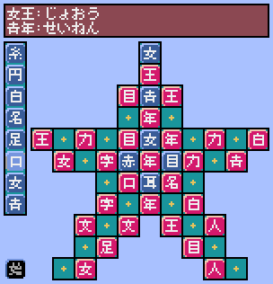

# ミニぴったん

[ことばのパズル もじぴったん](https://ja.wikipedia.org/wiki/%E3%81%93%E3%81%A8%E3%81%B0%E3%81%AE%E3%83%91%E3%82%BA%E3%83%AB_%E3%82%82%E3%81%98%E3%81%B4%E3%81%A3%E3%81%9F%E3%82%93)を参考にしました。

## 操作方法

* マウスを使って操作します。
* 左下の「始」をクリックすると開始します。
* 右クリックで、左の列の「漢字」を変更し、左クリックで、空いているマスに置きます。

## 遊び方

* 熟語ができるように、漢字一文字を置きます。
* すべてのマスに置いたら、ステージクリアです。

## プログラム

* 日本語フォントは、[8×8ドット日本語フォント「美咲フォント」](https://littlelimit.net/misaki.htm)を使用しました。
